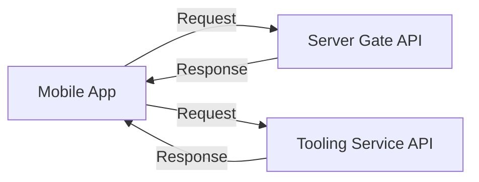
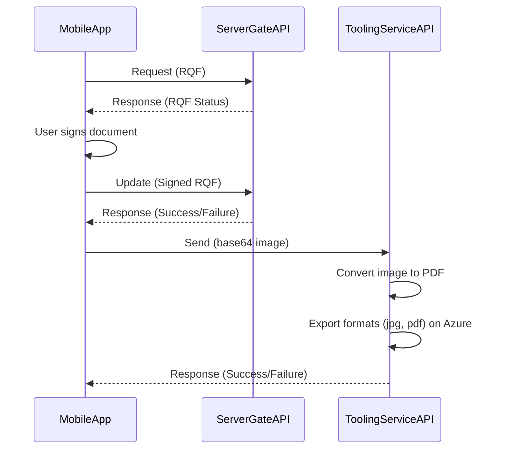

import { Callout } from 'nextra/components'

# Mobile App Development

This project is developed on top of React Native. In this article, you will have a chance to get familiar with the project on the following points

- How to install
- How the project structure looks like
- How to implement a new screen
- How to configure the integration with 3rd parties

## Installation

You can find the installation guide of this mobile app project at https://github.com/rp-erp/RPErpApp

## How the project structure looks like

Overall, we do not follow any common pattern in the world. We organize the project under `module` hierachy. All modules are stored in `src/app/module` folder. It can contains `sub module` itself. Each `sub module` contains `components`, `hooks`, and `screens` folder. Here is an example

```bash
src/app/module/sales-marketing
├── rfq-approval
│   ├── components
│   │   ├── rfq-pending-approval-list.component.tsx
│   │   └── rfq-signing-document.component.tsx
│   ├── hooks
│   │   ├── useGetRFQPendingApprovalList.tsx
│   │   ├── useGetRFQSigningDocument.tsx
│   │   ├── useRFQApprove.tsx
│   │   └── useRFQReject.tsx
│   └── screens
│       ├── rfq-pending-approval-list.screen.tsx
│       └── rfq-signing-document.screen.tsx
└── rfq-documents
    ├── components
    │   ├── rfq-document-list.component.tsx
    │   └── rfq-document-viewer.component.tsx
    ├── hooks
    │   ├── useGetRFQDocuments.tsx
    │   └── useUploadRFQDocument.tsx
    └── screens
        ├── rfq-document-list.screen.tsx
        └── rfq-document-viewer.screen.tsx
```

The tree diagram illustrates the folder structure of **Sales & Marketing** module. This module includes some **sub modules** such as `RFQ Approval` and `RFQ Documents`. Each sub module contains `components`, `hooks` and `screens` folder.

## How to implement a new screen

### Component and Screen Relationship

Each `component` contains a collection of pure react components that are used in an associated `screen`. For example, the screen `RFQPendingApprovalListScreen` defined in `rfq-pending-approval-list.screen.tsx` file looks like

```typescript showLineNumbers filename="rfq-pending-approval-list.screen.tsx"
export const RFQPendingApprovalListScreen = withRPLayout(
  (props: RPProps) => {
    return (
      <View>
        <RFQPendingApprovalList />
      </View>
    );
  },
  {
    Title: 'RFQ Pending Approval',
  }
);

```

Obviously, there's a file call `rfq-pending-approval-list.component.tsx` file that is associated with `rfq-pending-approval-list.screen.tsx` file. In *component* file, we have a pure component named `RFQPendingApprovalList`, we call this component is **main component**.

```typescript showLineNumbers filename="rfq-pending-approval-list.component.tsx"
export const RFQPendingApprovalList = (props: PendingApprovalListProps) => {
  return (
    <>
      <RPSearchBar onChange={handleSearch} />
      <FlatList
        showsVerticalScrollIndicator={false}
        data={getData()}
        renderItem={({ item }) => (
          <RFQPendingApprovalItem
            item={item}
            onDetail={onDetail}
            allowQuickSign={() => true}
            onQuickSign={onQuickSign}
          />
        )}
        keyExtractor={(item) => item.id}
        refreshControl={<RefreshControl refreshing={refreshing} onRefresh={onRefresh} />}
      />
    </>
  );
};
```

As can be seen that the `RFQPendingApprovalItem` is used in `RFQPendingApprovalList` component. It is allowed to define in `rfq-pending-approval-list.component.tsx` as well. It means that you can create multiple components that support the main component.

```js showLineNumbers filename="rfq-pending-approval-list.component.tsx"
export const RFQPendingApprovalList = (props: PendingApprovalListProps) => { 
  ...//implementation here
}

const RFQPendingApprovalItem = React.memo((props: RFQPendingApprovalProps) => {
  const { theme } = useTheme();
  const { item, allowQuickSign, onDetail, onQuickSign } = props;

  const hasQuickSign = () => allowQuickSign && onQuickSign;

  return (
    <TouchableOpacity onPress={() => onDetail(item)}>
      <ListItem bottomDivider containerStyle={{ paddingVertical: 0, minHeight: 50 }}>
        <Text>Quote #</Text>
        <ListItem.Content>
          <ListItem.Title>
            <Text bold>{item.quoteNumber}</Text>
          </ListItem.Title>
        </ListItem.Content>
        <View
          style={{
            flexDirection: 'row',
            columnGap: theme.breakpoint.md,
          }}
        >
          {
            //To show quick sign button
            hasQuickSign() && (
              <TouchableOpacity onPress={() => onQuickSign!(item)}>
                <View
                  style={{
                    flex: 1,
                    justifyContent: 'center',
                    alignItems: 'center',
                    padding: theme.breakpoint.xs,
                  }}
                >
                  <Icon
                    type="font-awesome-5"
                    name="signature"
                    size={theme.icon.size.sm}
                    color={theme.colors.primary}
                  />
                  <Text size="sm">Sign</Text>
                </View>
              </TouchableOpacity>
            )
          }
        </View>
        <ListItem.Chevron size={theme.font.size.lg} />
      </ListItem>
    </TouchableOpacity>
  );
});
```

### How to define a new navigation

We use `react-navigation` for the Navigation, you can find the navigation documentation at https://reactnavigation.org/docs/getting-started

With the support of navigation, we can navigate or redirect or switch from a screen to another screen easily. Apprarently, you can find navigation defination at `src/app/navigator`. The tree below shows all the exising navigation

```bash
src/app/navigator
├── AppNavigator.tsx
├── MainNavigator.tsx
├── RootNavigator.tsx
├── drawer-screen
│   ├── index.tsx
│   ├── it.drawer.tsx
│   ├── packaging.drawer.tsx
│   ├── phy-inv.drawer.tsx
│   ├── prod-status.drawer.tsx
│   ├── purchasing.drawer.tsx
│   └── sale-marketing.drawer.tsx
└── stack-screen
    ├── index.tsx
    ├── it.stack.tsx
    ├── purchasing.stack.tsx
    ├── sale-marketing.stack.tsx
    └── user.stack.tsx
```

`AppNavigator.tsx` is usually the main navigation file in a React Native application. It's where you define the different screens of your app and how to navigate between them. This file typically uses a navigation library like React Navigation. Here's a basic example of what an AppNavigator.tsx file might look like:

```typescript showLineNumbers
import React from 'react';
import { createStackNavigator } from '@react-navigation/stack';
import HomeScreen from './screens/HomeScreen';
import DetailsScreen from './screens/DetailsScreen';

const Stack = createStackNavigator();

function AppNavigator() {
  return (
    <Stack.Navigator initialRouteName="Home">
      <Stack.Screen name="Home" component={HomeScreen} />
      <Stack.Screen name="Details" component={DetailsScreen} />
    </Stack.Navigator>
  );
}

export default AppNavigator;
```

In this example, `AppNavigator` is a component that uses a stack navigator from React Navigation to define two screens: `HomeScreen` and `DetailsScreen`. The `initialRouteName` prop is used to specify which screen should be shown first when the app starts.

Please note that this is just a basic example. Your `AppNavigator.tsx` file might be different based on your app's requirements and the navigation library you're using

In terms of implementation, please refer the navigation document and review the existing code to understand how it work.

## How to configure the integration with 3rd parties

There are 2 api approviders as 3rd parties using in this mobile app

- Service Gate APIs: is to contain the main business implementation of RP-ERP project.
- Tooling Service APIs: is to contain the message queues and lightweight calculator to reduce the load from Service Gate APIs.



Here is an example of RFQ Approval Integration.



This diagram describes a sequence where the mobile app sends a request to the **Server Gate API**, receives a response, allows the user to sign a document, and updates the **Server Gate API** with the signed document. Then, the mobile app sends the signed document (as a `base64` image) to the **Tooling Service API**, which converts the `image` to a `PDF` and exports it in both `jpg` and pdf formats on Azure.

- To configure `Service Gate API` connection, go to `src/app/common/utilities.tsx`
- To configure `Tooling Service API` connection, go to `src/app/common/api-clients/rp-tooling/config.ts`

<Callout type="warning" emoji="⚠️">
  Note: For VN Team, we are using `Cloud` and `Local`.
</Callout>
