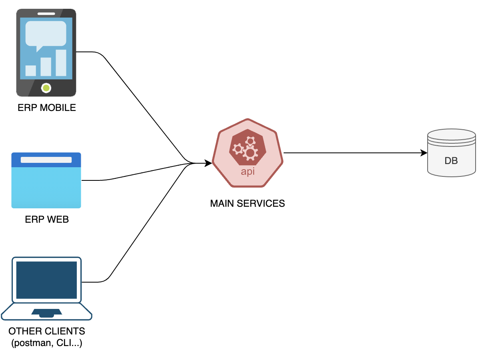
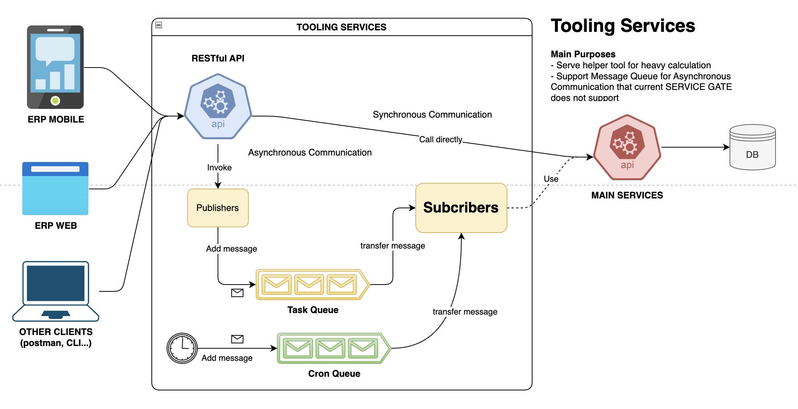
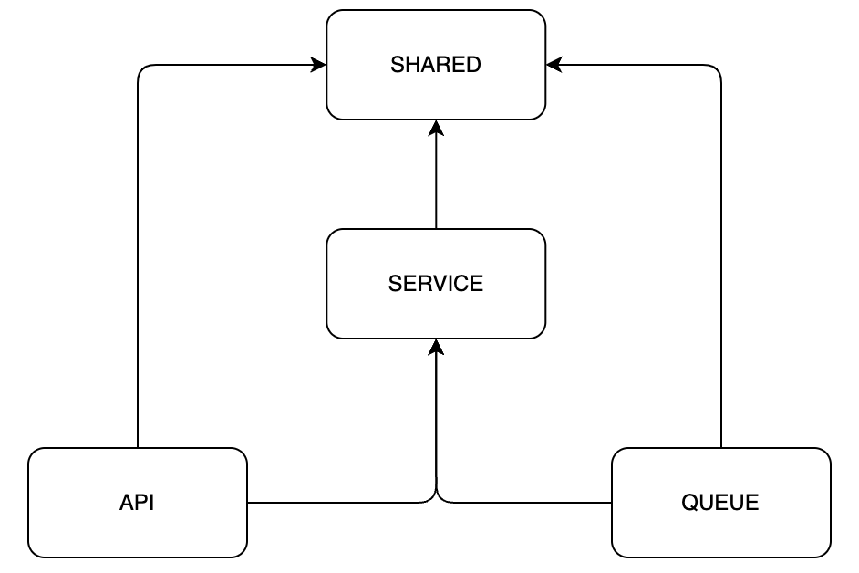
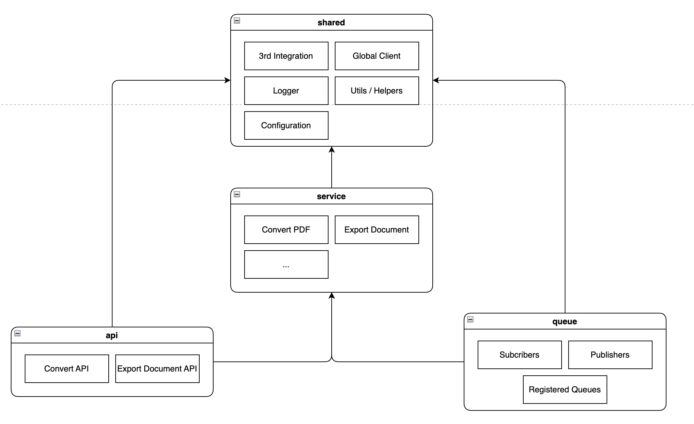

# Tooling Services Development

## Table of Contents

- [External Communication](#external-communication)
  - [Communication without Tooling Service](#communication-without-tooling-service)
  - [Communication via Tooling Services](#communication-via-tooling-services)
    - [Synchronous Communication via RESTful API](#synchronous-communication-via-restful-api)
    - [Asynchronous Communication via Message Queue](#asynchronous-commnication-via-message-queue)
- [Internal Communication](#internal-communication)
- Development Guide
  - How to implement a Service Provider
  - How to implement Restful API
  - How to implement Queue Processor
  - How to implement Cron Queue

This document illustrates the external and internal communication of Tooling Service.

## External Communication

### Communication without Tooling Service

The following diagram decribes how our ERP System works together without Tooling Service.

As can be seen that all clients such as Mobile App, ERP Web or other API Clients like Postman interact with our system through Main Services (Service Gate) and receive the response in **synchronous communication** way. This synchronous communication approach has an advantage, allowing clients to retrieve the result from the server in `realtime`. However, it also has a downside that if the Main Services are trying to process **a heavy task**, it can **delay the clients receiving the output** and causes a poor UX experience.

### Communication via Tooling Services

In order to resolve the **delayed** issue when communicating synchronously, Tooling Service jumps into the play.

According to the diagram, the clients now interacting with the ERP System via RESTful API endpoint that exposes from Tooling Services. In general, Tooling Services supports two way of communication

- Synchronous via RESTful API.
- Asynchronous via Message Queue that facilitates the Pub-Sub pattern

#### Synchronous Communication via RESTful API

There're two use cases of synchronous communication via RESTful API

- Sending a message to a message queue via Publisher.
- Calling Main Services API for some business customization: This approach is used when you want to customize the request before sending to our main services or doing some pre-calculation before hand. Basically, this way keeps the implementation in Main Service reusable internally and avoid `Anti-IF` pattern.

For example, **Converting Image to Pdf** is not a responsibility of Main Services. Therefore, you can develop this feature in Tooling Services and exposes via RESTful API.

Another example for **Caching**, you want to cache the response from the Main Services for the next query. You can use Tooling Service as a _Reversed Proxy_, forward the client request to main service and cache the response into caching database that Tooling Services is integrating with. With this use case, The performance of our system will be significantly improved.

#### Asynchronous Commnication via Message Queue

Just want to emphasize that this process happens after the **Publisher** and **Cron** add new message into the **Message Queue**. Then, Subcribers will perform the business logic and returns the response in background. In addition, you can monitor the process and result by using Bull Board at http://127.0.0.1/admin/queues.

When it comes to the implementation in Subcriber component, it can be developed indenpendently or dependent on Main Services to serve some heavy business task purposes.

For example, The PO Signature use case, just consider the CEO is busy all the time so he wants to sign all **Purchase Order Approval **in the fastest way, so the mobile should not wait the server to validate the signature, mark the approval and upload the document to the cloud. Consequently, we should response our CEO the status as approval is processing immediately and allows him to sign the next one. For the unprocessed server tasks, we can delegate them to a queue and execute them later on.

## Internal Communication

There're four main components in Tooling Services project

- `shared`: To store all common use lib that share with among components in this project
- `service`: To store all `main or business logic` of a service that will be used in `api` or `queue`
- `api`: To store the implementation that exposes the gateway to the clients via the RESTful API endpoints
- `queue`: To store the implementation that will work in the background. It will be triggered by `api` or by itself via `cron`.

Please see the diagram below for more details

In general, you can understand the internal communication like following:

- All components can use all modules in `shared`.
- `api` and `queue` must use `service` for the business implementation.

## Development Guide

### How to implement Restful API

Updating...

### How to implement a Service Provider

Updating...

### How to implement Restful API

Updating...

### How to implement Queue Processor

Updating...
