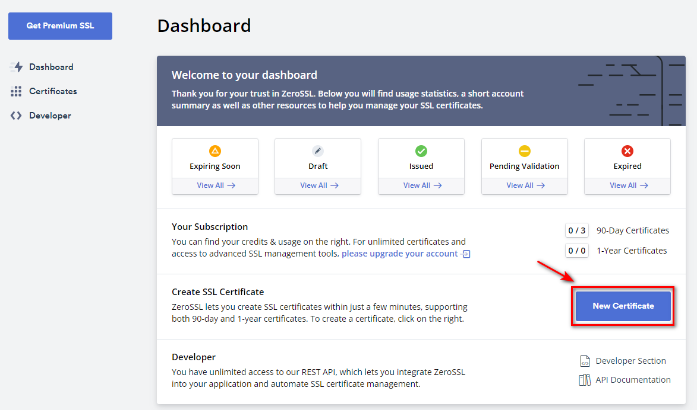
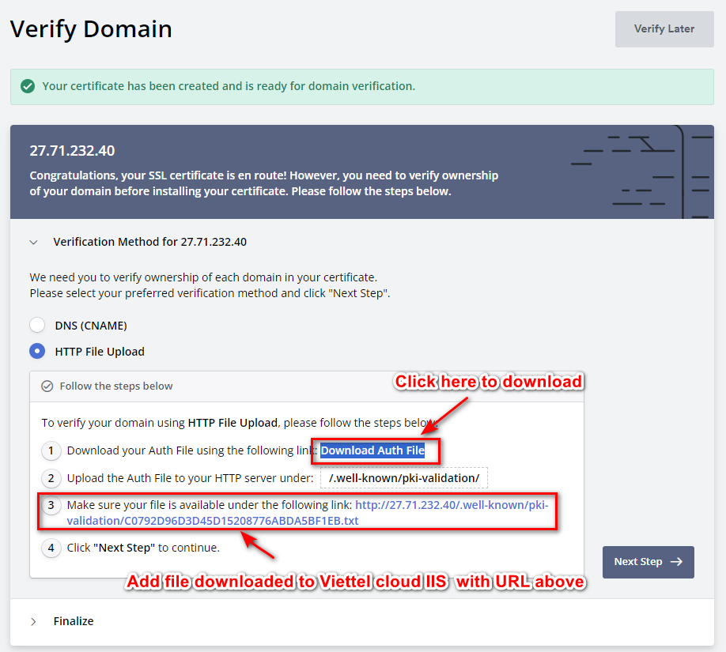
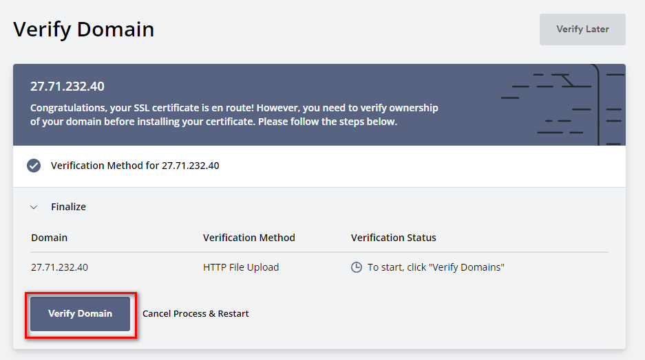
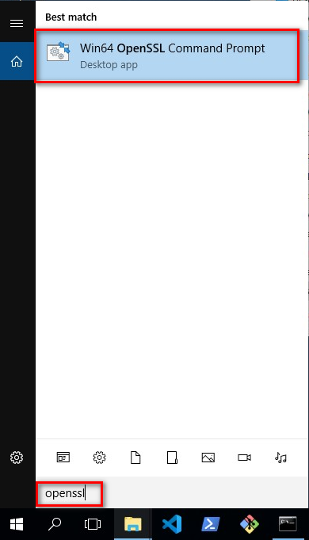
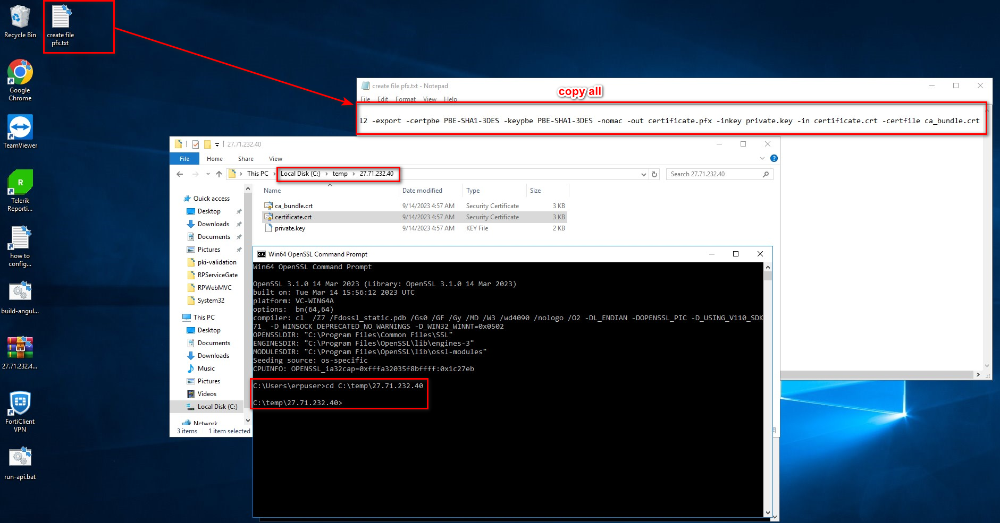
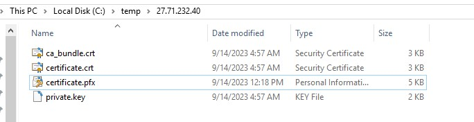
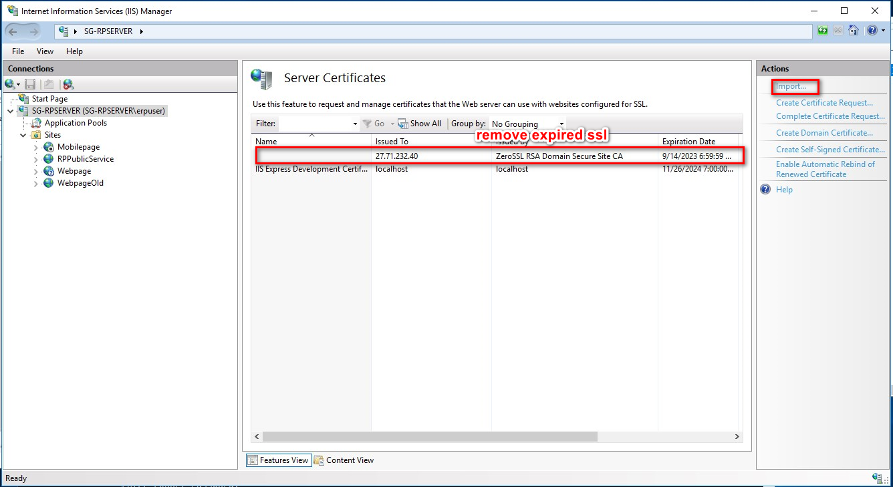
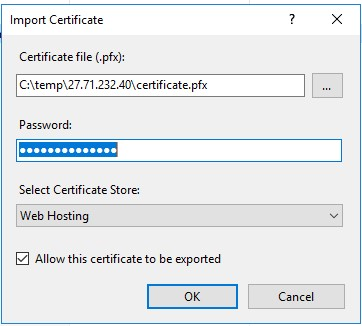

# Create SSL for Viettel Cloud

1. Create new account at ZeroSSL . With new account will be Free 3 months
2. In Dashboard, click New Certificate (Image 1)

3. Enter required information (Domains: 27.71.232.40; Validity: 90-Day Certificate; Finalize Your Order: Free) => click Next Step
4. Verification Method for 27.71.232.40 choose HTTP File Upload and Download Auth File. After download complete, click Next Step  (Image 2)

5.Add file downloaded to Viettel cloud IIS  with URL in Image 2
6. Click Verify Domain (Image 3)

7. Download Certificate as zip file (Image 4) and click Next Step

8. Extract zip file on Viettel Server, open Start Menu, type openssl, open program and browse to extracted folder (Image 5)

9. Copy content file create file pfx.txt and run in Open SSL cmd (Image 6)

10. Enter password, this password use to import certificate into IIS (ex: robinsonpharma), after done, we have certificate.pfx file in extracted folder (Image 7)

11. Open IIS Manager → Server Certificates → Remove old certificate (if any) → Click Import (Image 8)

12. Use pfx file create before and password enter at step 10 → click OK (Image 9) 

13. In IIS choose each Website and update binding to new certificate (Image 10)

