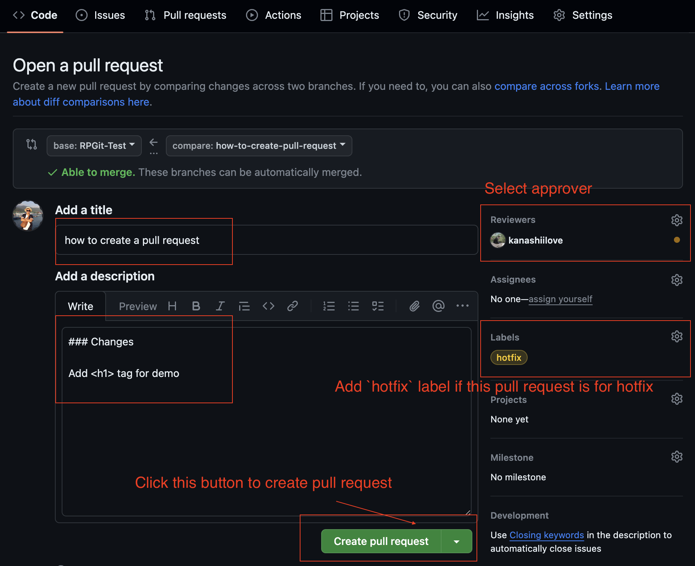

import { Callout, Tabs } from 'nextra/components'

# Git Strategies & Release Management

## Overview

The release cycle has 5 phases

- Phase 1: Start new release
- Phase 2: Develop
- Phase 3: Release
- Phase 4: Hotfix release (*Optional*)
- Phase 5: Close the release

## Branches

### `Default` branch

- All branches have suffix `Test` in name are default branches: `RPGlobal-Test`, `RPServiceGate-Test`, `RPWebMVC-Test`, `AppTest`
- `Test` branches have the latest commits including **New features**, **Bugfixes** and **Hotfixes**
- `Test` branches are the base branches of Developers on their daily work. It means that all commits MUST BE merged into `Test` branches first.

### `Release` branch

- `Release` branch is created at **Phase 1: Start new release** and based on `Test` branch.
- Release branch's name has the following convention `Release-<YYYYMMDD>`. For example, the release name `Release-20231121` indicating that all commits in this branch are releasing on *21 November, 2023*
- All commits are ready to push into `Release` branch must come from `Test` branch and pushed by using `cherry-pick` instead of `merge`

### `Deploy` branches

<Callout type='info' emoji="📕">
  Deploy branches will be used for CI/CD pipeline in the future
</Callout>

### `Snapshot` branches

- All the branches such as: `RPGlobal`, `RPServiceGate`, `RPWebMVC` and `RPErpApp` are `Snapshot` branches.
- `Snapshot` branches includes the current version of the previous release. 
- `Snapshot` branches is used for backup if there's big impact on the current release which cannot rollback.

There're 2 deploy branches: `deploy/erptest` and `deploy/production`

- `deploy/erptest` is to deploy on **ErpTest** environment
- `deploy/production` is to deploy on **Production** environment
- all commits in both `deploy/erptest` and `deploy/production` are synced from `Release` branch by using git command `git reset --hard Release-<YYYYMMDD>`

Here is the diagram describings how the branches work.

## Release Cycle

This section is to show WHO do WHAT. There're 3 basic roles in this release cycle

- Lead or Release Manager
- Developer
- Tester

### Phase 1: Start new release

**THINGS TO DO**

- [ ] Determine the **Scope** and the **Due Date** of the release.  
- [ ] Prepare the `Release` branch.

<Tabs items={['Lead']}>
  <Tabs.Tab>
    - Create a new `Release` branch is based on `Test` branch with name convention `Release-<YYYYMMDD>` for all repositories: `RPGlobal`, `RPServiceGate`, `RPWebMVC`, and `RPErpApp`
  </Tabs.Tab>
</Tabs>

### Phase 2: Development

**THINGS TO DO**
- [ ] Develop new features, provide bugfixes or hotfixes (if any).
- [ ] Verify the changes

<Callout type='warning' emoji="❤️‍🔥">
  The hotfixes can be deployed at **Phase 3: Release** or **Phase 4: Hotfix Release**. It depends on the impact of the bugs.
</Callout>

<Tabs items={['Lead', 'Developer', 'Tester']}>
  <Tabs.Tab>
  The list of open pull requests

  
  
    - Review and Merge Pull Requests of team members into `Test` branch. Note that **Use `Squash and Merge` to combine multiple commits into single commit, it helps for cherry-pick a lot**
    - `cherry-pick` merged commits into `Release` branch
    - `cherry-pick` hotfix commits into `Deploy` branch from `Release` branch (*If any*)
    - *Sync all commits from `Release` branch into `deploy/erptest` (if needed)*
  </Tabs.Tab>
  <Tabs.Tab>
    - Create a new branch from `Test` branch
    - When the features, bugfixes or hotfixes are DONE, create a Pull Request to `Test` branch for review
    - Notify Lead for review.
    
    **How to create Pull Request**

    Step 1

    

    Step 2

    

    Step 3: If your pull request is for `hotfix`, add `hotfix` label. Otherwise, leave it blank.

    

  </Tabs.Tab>
  <Tabs.Tab>
    - Deploy the `Test` branch on Cloud everyday
    - Verify all the changes from Developers for the release.
    - Create bug ticket (*If any*)
  </Tabs.Tab>
</Tabs>

### Phase 3: Release

**THINGS TO DO**
- [ ] Deploy on `ErpTest` and `Production`

<Callout type='info' emoji="✅">
  Ensure all changes have been PASSED all tests.
</Callout>

This phase is to release (deploy) all changes from the **Phase 2: Development**

<Tabs items={['Lead']}>
  <Tabs.Tab>
    - Review all commits for the release.
    - Sync all commits from `Release` branch into `deploy/erptest` and `deploy/production` branch.
    - Create build and deploy on `ErpTest` and `Production`
  </Tabs.Tab>
</Tabs>

### Phase 4: Hotfix Release (*Optional*)

**THINGS TO DO**
- [ ] Re-deploy the **hotfixes** on `ErpTest` and `Production`

<Callout type='warning' emoji="❤️‍🔥">
  - This phase does NOT depend on other phases and can be released whenever necessary.
  - This phase only happens if critical bugs found on Production needed to fix ASAP.
  - This phase only includes DEPLOYMENT not DEVELOPMENT works. All hotfixes have been already done at **Phase 2: Development**
</Callout>

<Tabs items={['Lead']}>
  <Tabs.Tab>
    - Sync `hotfix` commits from `Release` branch into `deploy/erptest` and `deploy/production` branch.
    - Create build and re-deploy on `ErpTest` and `Production`
  </Tabs.Tab>
</Tabs>

### Phase 5: Close the release

The quality of the release is good and stable enough to move the next release.

**THINGS TO DO**
- [ ] Create a snapshot for the release.

<Tabs items={['Lead']}>
  <Tabs.Tab>
    - Sync all `Release` branches with `RPGlobal`, `RPServiceGate`, `RPWebMVC` and `RPErpApp` branch
  </Tabs.Tab>
</Tabs>
